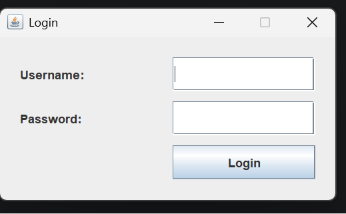
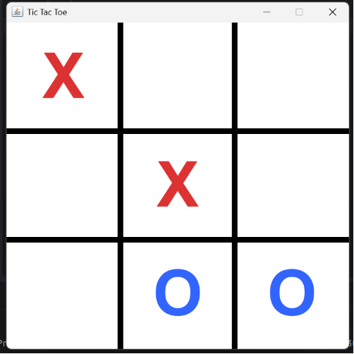
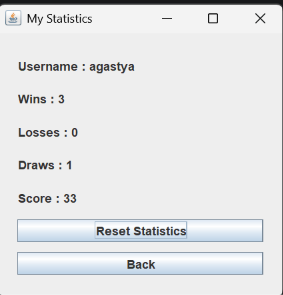
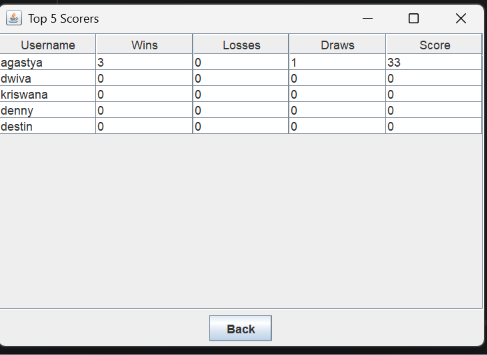

# mini project tic tac toe using java Swing and GUI


**Nama:** I Made Agastya Dwiva Kriswana  
**NRP:** 5026251035  
**Kelas:** E

---

## Deskripsi Proyek

Proyek ini merupakan aplikasi permainan Tic-Tac-Toe berbasis Java Swing yang terintegrasi dengan database MySQL. Aplikasi memungkinkan pengguna untuk melakukan login, memainkan permainan, menyimpan statistik permainan, serta menampilkan lima pemain dengan skor tertinggi.

Proyek ini menerapkan konsep Pemrograman Berorientasi Objek (Object-Oriented Programming) dengan membagi program ke dalam beberapa kelas yang memiliki tanggung jawab masing-masing.

---

## Fitur Aplikasi

- Login pengguna menggunakan database MySQL.
- Menu utama aplikasi.
- Permainan Tic-Tac-Toe berbasis Java Swing.
- Deteksi kondisi menang, kalah, dan seri.
- Perhitungan skor secara otomatis.
- Penyimpanan statistik pemain.
- Menampilkan statistik pemain.
- Menampilkan Top 5 pemain berdasarkan skor.
- Koneksi database menggunakan JDBC.

---

## Teknologi yang Digunakan

- Java
- Java Swing
- MySQL
- JDBC
- IntelliJ IDEA

---

## Struktur Project

```text
tic tac toe pemdas/
│
├── src/
│   └── game/
│       ├── Main.java
│       ├── DatabaseManager.java
│       ├── Player.java
│       ├── PlayerService.java
│       ├── GameLogic.java
│       ├── LoginFrame.java
│       ├── MainMenuFrame.java
│       ├── GameFrame.java
│       ├── StatisticsFrame.java
│       └── TopScorersFrame.java
│
├── database/
│   └── schema.sql
│
├── screenshots/
│
└── README.md
```

---

## Database

Nama database:

```sql
game_project
```

Nama tabel:

```sql
players
```

Struktur tabel:

| Kolom | Tipe Data |
|------|-----------|
| id | INT |
| username | VARCHAR(50) |
| password | VARCHAR(100) |
| wins | INT |
| losses | INT |
| draws | INT |
| score | INT |

---

## Cara Membuat Database

```sql
CREATE DATABASE IF NOT EXISTS game_project;

USE game_project;

CREATE TABLE players (
    id INT NOT NULL AUTO_INCREMENT,
    username VARCHAR(50) NOT NULL,
    password VARCHAR(100) NOT NULL,
    wins INT DEFAULT 0,
    losses INT DEFAULT 0,
    draws INT DEFAULT 0,
    score INT DEFAULT 0,
    PRIMARY KEY (id),
    UNIQUE KEY username (username)
);
```

Contoh data:

```sql
INSERT INTO players(username, password, wins, losses, draws, score)
VALUES ('agastya', '12345', 0, 0, 0, 0);
```

Akun yang dapat digunakan:

- Username: agastya
- Password: 12345

---

## Cara Menjalankan Program

1. Jalankan MySQL Server.
2. Buat database `game_project`.
3. Jalankan file `schema.sql`.
4. Buka proyek menggunakan IntelliJ IDEA.
5. Tambahkan JDBC Driver MySQL.
6. Sesuaikan konfigurasi pada `DatabaseManager.java`.
7. Jalankan file `Main.java`.

---

## Penjelasan Class

### Main
Berfungsi sebagai titik awal program dan membuka halaman login.

### DatabaseManager
Berfungsi untuk menghubungkan program dengan database menggunakan JDBC.

### Player
Menyimpan data pemain seperti id, username, jumlah kemenangan, kekalahan, seri, dan skor.

### PlayerService
Mengelola proses login, pembaruan statistik, dan pengambilan data Top 5 pemain.

### GameLogic
Mengatur aturan permainan seperti validasi langkah, pengecekan pemenang, dan kondisi seri.

### LoginFrame
Menampilkan halaman login untuk memasukkan username dan password.

### MainMenuFrame
Menampilkan menu utama setelah pengguna berhasil login.

### GameFrame
Menampilkan papan permainan Tic-Tac-Toe.

### StatisticsFrame
Menampilkan statistik pemain.

### TopScorersFrame
Menampilkan lima pemain dengan skor tertinggi menggunakan JTable.

---

## Sistem Penilaian Skor

| Hasil Permainan | Penambahan Skor |
|-----------------|-----------------|
| Menang | +10 |
| Seri | +3 |
| Kalah | +0 |

---

## Alur Program

1. Program dijalankan melalui `Main.java`.
2. Halaman login ditampilkan.
3. Pengguna memasukkan username dan password.
4. Sistem memeriksa data pada database.
5. Jika login berhasil, menu utama ditampilkan.
6. Pengguna memulai permainan.
7. Program menentukan hasil permainan.
8. Statistik diperbarui ke database.
9. Pengguna dapat melihat statistik pribadi.
10. Pengguna dapat melihat Top 5 pemain.

---

## Screenshot Program

### Halaman Login



### Halaman Menu Utama


### Halaman Permainan



### Halaman Statistik



### Halaman Top 5 Skor



---

## Link Video YouTube

(https://youtu.be/egeeP2NHL1w)

---

## Kesimpulan

Proyek ini berhasil menerapkan konsep dasar pemrograman Java melalui aplikasi berbasis Java Swing yang mengintegrasikan antarmuka pengguna, logika permainan, dan database. Program dapat melakukan login, menjalankan permainan, menyimpan statistik pemain, serta menampilkan peringkat pemain berdasarkan skor yang diperoleh.
